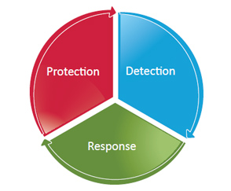
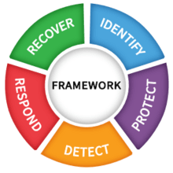
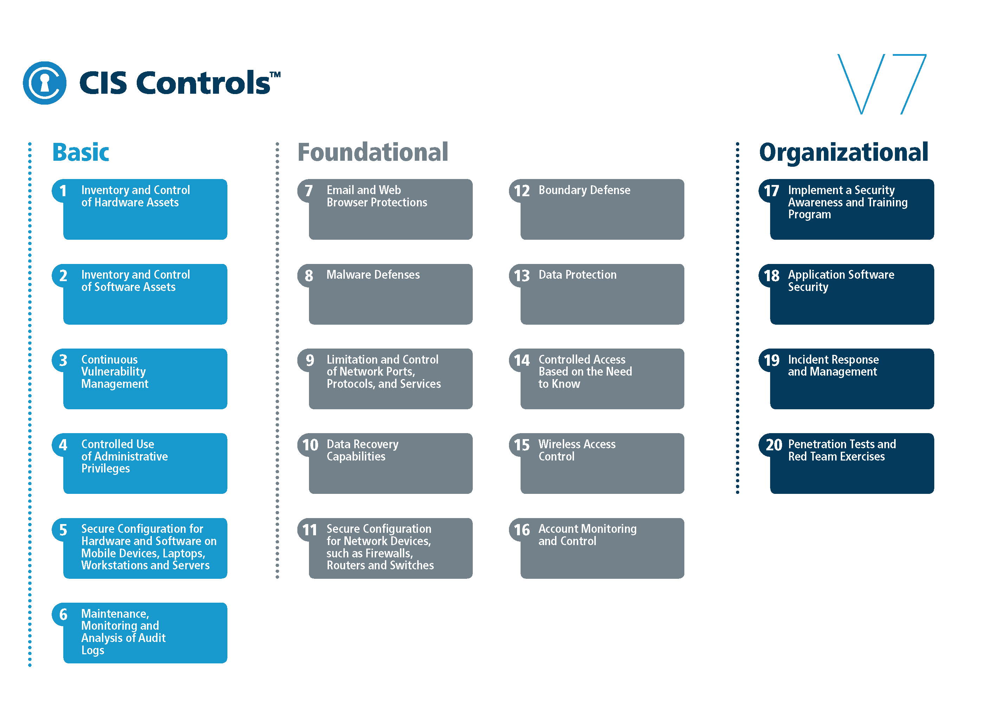

# EC601-mini-project-2
## Why security framework
Being connected to the big, diverse Internet also means revealing some vulnerabilities of ourselves to the entire Internet and Internet users, willingly or unwillingly. While we are concerning about the leak of personal information when surfing on webs, social medias, something more evil are lurking in the dark, hunting after something more valuable, like our bank accounts. Not just individuals, from small businesses, private-owned companies to multi-national companies, even countries, they are all subjected to all kinds of cyberattacks.

Here are some of the world’s largest cyberattacks happened in the past few decades:
Qouted from google: 
### 1. Yahoo!: hackers favourite target?
In 2014, Yahoo! announced it had suffered a cyber attack in 2014 that affected 500 million user accounts constituting the largest massive hacking of individual data directed against a single company. Names, dates of birth, telephone numbers and passwords were stolen. While the company assured users that banking data had not been affected, it nonetheless recommended caution. Prior to this event, in 2012, the hacker “Peace” had sold 200 million usernames and passwords for $1900.
Because bad things always come in threes...
... in March, Yahoo! confessed to being hacked once again. This time, "only" 32 million accounts were affected. But the cyberattack relaunched the investigation of the 2014 hack, as the attackers used a tool stolen that year, allowing them to create malicious cookies and log in without passwords. A direct result of this is that the firm was bought by Verizon in 2017 for $ 4.5 million instead of the $ 4.8 million announced in 2016. Update (Dec 2018): Yahoo has now admitted that all of the 3 billion user accounts had been hacked in 2013. This cyber-attack is the most significant in Internet history. 

### 2. Marriott hotels: privacy of 500 million customers compromised
Information from up to 500 million guests at the Marriott-owned Starwood hotel group has been compromised, including banking data. The rift had been open since 2014 and was first spotted September 2018. Even if, as Marriott says, the number of customers that suffered a breach of personal information is anywhere near 327 million, the implications are massive. Information accessed includes payment information, names, mailing addresses, phone numbers, email addresses, passport numbers, and even details about the Starwood Preferred Guest (SPG) account, a high-end card recently launched by the American Express credit card issuer for regular travellers.
"Marriott was first alerted to a potential breach in September, it said, when an internal security tool found someone was trying to access its database. It then found that people seemed to have been in the database since 2014, and they had copied information apparently with a view to taking it."
Marriott now face $123 million fine by UK authorities over this breach. 

When it comes to businesses or countries, leaking of classified documents, customers’ information can be fatal, causing millions, even billions of lost in interest and having downward effects on reputation. Some degrees of knowledge of cybersecurity can make a difference. 
Although it seems implausible to stop all cyberattacks just by simply asking hackers to do so, there are at least something we can do to prevent ourselves from cyberattacks, or mitigate our lost, like never save your login info on public machines, and changing password regularly.  
Similarly, there are something businesses and organizations can do in terms of lowering the risk of information leaks. For instance, look at and use a security framwork.

## What’s security framework
A simple dynamic network security model is illustrated as follow:   

A Prevention, Detection and Response Mechanism:
Protection: building the right controls to protect from hackers getting in
Detection: detecting when someone is trying to get through those protections
Reaction:  quickly mitigating any exposure, recovering systems and/or data, and minimizing downtime

To some extent, a security framework is to tell you what implementations are needed to realize this mechanism and how to implement them.

Again, quoted from Google:
An IT security framework is a series of documented processes used to define policies and procedures around the implementation and ongoing management of information security controls in an enterprise environment. These frameworks are basically a blueprint for building an information security program to manage risk and reduce vulnerabilities. Information security pros can utilize these frameworks to define and prioritize the tasks required to build security into an organization.
In a nutshell, frameworks are some generally written guidelines and procedures to be followed for the purpose of improve organization’s cyber security level, lower the risk of lost in all kinds of information, and mitigate lost, if, inevitable attacks happen.

Take a look at some most use security framework:
1.NIST     
       

2.PCI DSS      
The Payment Card Industry Data Security Standard (PCI DSS) is an information security standard for organizations that handle branded credit cards from the major card schemes.    
3.CIS     

